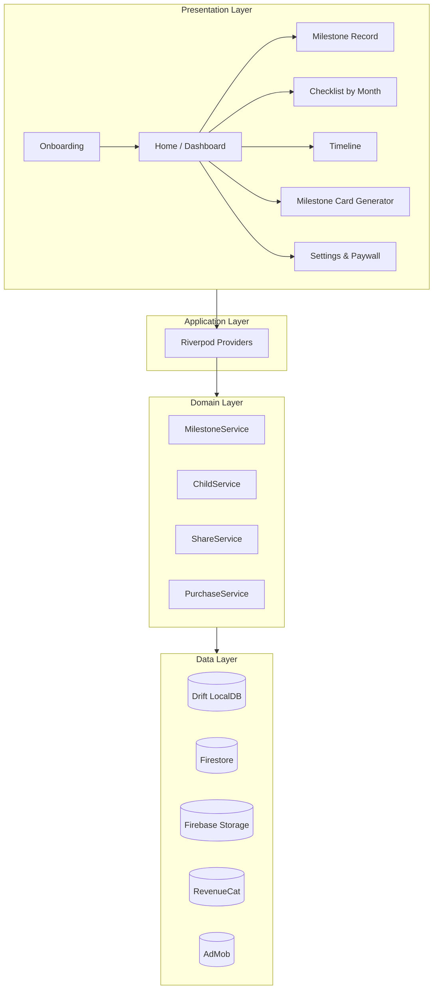

# 設計書 — Baby Mile

> 作成: 2026-05-04 / Phase 7
> 担当: 本田 圭佑

## アーキテクチャ概観



## 主要 Provider

```dart
final childListProvider = StateNotifierProvider<ChildListNotifier, List<Child>>(...);
final activeChildProvider = StateProvider<Child?>(...);
final milestonesByChildProvider = FutureProvider.family<List<MilestoneRecord>, String>(...);
final checklistProvider = FutureProvider.family<List<MilestonePreset>, int>(...); // by month
final paywallStateProvider = StateNotifierProvider<PaywallNotifier, PaywallState>(...);
final cardRendererProvider = Provider<CardRenderer>(...);
```

## ルーティング (go_router)

```
/onboarding (初回のみ)
/home (ダッシュボード)
/record/:milestoneKey
/checklist/:month
/timeline
/card/:milestoneId
/settings
/paywall
```

## マイルストーンプリセット（50+ 抜粋）

| key | category | min-max month |
|-----|----------|---------------|
| first_smile | social | 0-3 |
| coo | language | 1-4 |
| roll_over | motor | 3-6 |
| sit_unsupported | motor | 5-9 |
| crawl | motor | 6-11 |
| pull_up_to_stand | motor | 8-12 |
| first_word | language | 9-15 |
| walk_first_step | motor | 9-18 |
| wave_byebye | social | 9-15 |
| ... | ... | ... |

(全50+項目は `lib/data/milestone_presets.dart` で定義する)

## カード生成

- `RepaintBoundary` + `boundary.toImage()` で PNG/JPEG 化
- テンプレートは `Stack` ベースで写真 + 日付 + 月齢 + ひとことを配置
- サイズ切替: 1080x1920（縦長）/ 1080x1080（正方形）/ 1920x1080（横長）

## 通知設計

- `flutter_local_notifications` を foundation 経由で利用
- 子供の生年月日から月齢の節目（1mo, 3mo, 6mo, 9mo, 12mo, 18mo, 24mo, 36mo）を計算
- 各節目の3日前にチェックリストへ誘導

## エラーハンドリング

- ネット未接続 → ローカル保存 + 同期キュー
- 写真容量超過 → 自動圧縮 + ユーザ通知
- Firebase 障害 → ローカル動作 + バックグラウンド再試行
