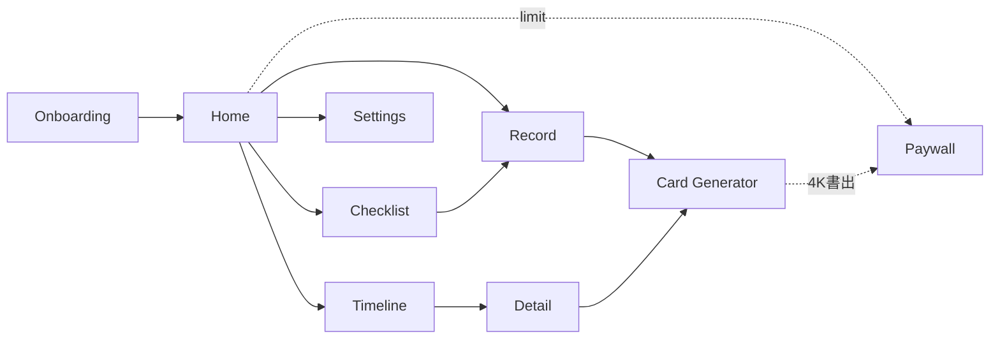

# ナビゲーション設計 — Baby Mile

> 作成: 2026-05-04 / Phase 7

## go_router パス

```
/onboarding (初回のみ)
/home
  /record
  /record/:milestoneKey
/checklist
  /checklist/:month
/timeline
  /timeline/:milestoneId (Detail)
/card/:milestoneId
/settings
  /settings/children
  /settings/notification
  /settings/legal
/paywall
```

## 主な遷移



## 状態保持

- アクティブな子供は `activeChildProvider` で SharedPreferences に保存
- 月齢タブの選択状態は画面ローカル state
